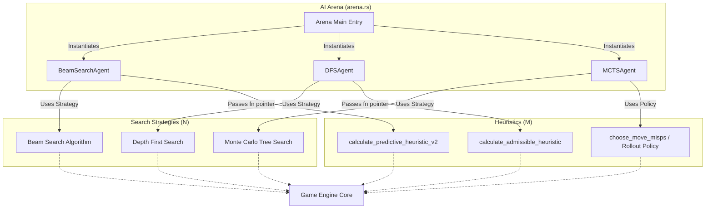

# PopStar Engine Architecture & Foundational Knowledge

This document describes the architectural design of the PopStar AI Solver, focusing on our $N \times M$ orthogonal architecture, foundational game mechanics, exact search optimizations, and heuristic strategies.

## 1. Game Rules & Mathematical Equivalence

PopStar is played on a 10x10 grid of colored blocks. Players click groups of two or more same-colored adjacent blocks to eliminate them, scoring `n * n * 5` points for `n` blocks. Remaining blocks fall (gravity), and empty columns are consolidated by shifting columns to the left. The game ends when no valid groups remain. A bonus (up to 2000 points) is awarded based on the number of blocks left, with the maximum for a clear board.

**Mathematical Equivalence:** 
PopStar is mathematically equivalent to the well-known computer science problem **SameGame** (or Clickomania). 
In 2001, Biedl et al. proved in *"The Complexity of Clickomania"* that determining whether a given board can be completely cleared is **NP-Complete**. Because of this, it is mathematically proven that no polynomial-time algorithm exists to find the absolute perfect score for a 10x10 board (unless P=NP). This necessitates the use of heuristic and approximation algorithms (like Beam Search or MCTS) for full-board solving, while exact algorithms (like DFS) are limited to shallow depths or smaller sub-problems.

## 2. Orthogonal Architecture ($N \times M$ Matrix)

To accelerate AI development and experimentation, the solver employs an $N \times M$ orthogonal architecture. 
This means **Search Algorithms** ($N$) and **Heuristics/Evaluation Functions** ($M$) are strictly decoupled. You can mix and match any Search Algorithm with any Heuristic using generic function pointers, enabling rapid testing of combinations like `BeamSearch + Predictive V2` or `MCTS + Predictive V1`.

### Architecture Flow

### Important Constraint for DFS (Branch & Bound)
While approximate search algorithms (Beam Search, MCTS, Greedy) can use ANY heuristic (predictive, non-admissible, etc.), **Exact DFS MUST use an Admissible Heuristic**. 
*   **Admissible** means the heuristic *never* underestimates the true cost to reach the goal (in our case, never underestimates the max possible score).
*   If you feed a predictive heuristic (which uses negative penalties like the Orphan Penalty) into DFS, DFS will use those low bounds to incorrectly prune the optimal branch, destroying its guarantee to find the mathematically perfect solution.

## 3. Exact Search: Depth-First Search (DFS) & Branch and Bound

For exact optimization at shallow depths, we employ Depth-First Search (DFS). To make this feasible, several critical optimizations are necessary:

### Branch and Bound Pruning
We prune sub-optimal branches early by comparing the current score plus an **Admissible Heuristic** (Upper Bound) against the best-known score.
*   **Admissible Heuristic (`calculate_admissible_heuristic`):** Calculates an optimistic upper bound. It sums `k_C * k_C * 5` for each color `C` (where `k_C` is the total count of blocks of that color), then adds the maximum end-game bonus (2000 points). Since mathematically $(A+B)^2 > A^2 + B^2$, assuming all tiles of one color can be cleared simultaneously is the strict theoretical maximum score. This guarantees we never mistakenly prune the optimal path.

### Zero-Allocation Engine (Extreme Performance)
The core bottleneck in DFS tree traversal is memory allocation (GC/Heap churn). We implemented extreme exact optimizations to achieve ~400% speedups:
*   **Zero-Allocation Group Finding & Elimination:** Instead of allocating `Vec<Vec<(usize, usize)>>` to find groups, we use in-place, stack-allocated arrays (`[(0,0); 100]`) for flood-fills (`eliminate_group_by_click`).
*   **O(N) Game Over Check:** Replaced full-board group identification with a lightweight adjacency check (only verifying the Right and Down neighbors of each tile).
*   **Zero-Allocation Heuristic Playouts:** When `depth_limit` is reached, `evaluate_with_heuristic` simulates the rest of the game. Instead of cloning the heavy `Game` struct (which tracks a `history` vector of moves), we only clone the 100-byte `Board` array, completely eradicating heap allocations in the hot loop.
*   **Packed Bitboard Hashing:** State deduplication `visited_states` relies on `HashMap`. By compressing the 100 3-bit tiles into a `[u64; 5]` array (`to_packed()`), we drastically shrink memory usage and speed up equality checks.

## 4. Heuristics & Evaluation Strategies

The engine implements multiple heuristic functions, ranging from simple greedy single-step choices to complex state evaluators used by Beam Search and DFS.

### Single-Step Greedy Move Selectors
These heuristics choose the "best" immediate move based on a specific strategy. They are useful for fast playouts (rollouts) or as simple baselines:
* **`choose_move_mis` (Maximize Immediate Score)**: Selects the move yielding the highest immediate score (`n * n * 5`).
* **`choose_move_lgp` / `choose_move_sgp` (Largest/Smallest Group Priority)**: Selects the group with the most (or least) tiles, regardless of score.
* **`choose_move_crp` (Color Reduction Priority)**: Simulates all moves and chooses the one that minimizes the number of unique colors remaining on the board.
* **`choose_move_misps` (Maximize Immediate Score & Penalize Singletons)**: Balances immediate score with a severe penalty for creating truly isolated single tiles. Used as the default fast playout evaluation.
* **`choose_move_misps_clear_tiebreak`**: Uses MISPS, but tie-breaks top candidates by choosing the one that minimizes the total number of tiles remaining on the board.
* **`choose_move_clear_focus` (Clear Focus)**: Simulates moves and selects the one that results in the minimum number of total tiles remaining on the board.
* **`choose_move_avoid_orphans` (Avoid Orphans)**: Maximizes score but heavily penalizes moves that create "orphan" colors (only 1 tile of that color remaining).
* **`choose_move_preserve_largest_color_group` (Color Reservation)**: Identifies the largest color group and tries to clear other colors first, assigning a score of 0 to moves that clear the preserved color.
* **`choose_move_connectivity_focus` (Connectivity Focus)**: Looks ahead one step to maximize the size of the largest group in the *next* board state.

### State Evaluators
These functions evaluate the overall "goodness" or potential of a given board state, crucial for algorithms like DFS and Beam Search:
* **`calculate_admissible_heuristic`**: Calculates an optimistic upper bound. It sums `k_C * k_C * 5` for each color `C`, plus the 2000 endgame bonus. Used strictly by **DFS** for Branch and Bound pruning to guarantee optimal paths are never pruned.
* **`calculate_predictive_heuristic` (Predictive Heuristic V2)**: A realistic static evaluation function designed for **Beam Search**. Instead of just looking at immediate score, it heavily penalizes fragmented boards. It deducts points for isolated tiles, "orphan" colors (which make perfect clears impossible), and crucially, applies a "Component Splitting Penalty" when tiles of the same color are fragmented into multiple disconnected groups.

